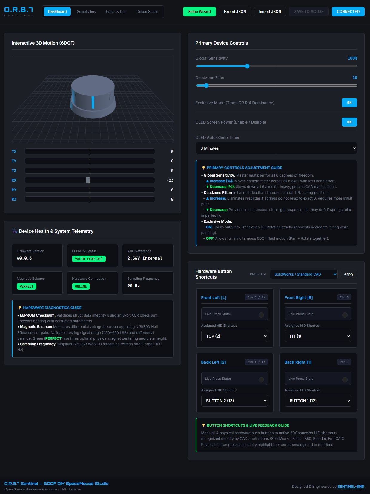
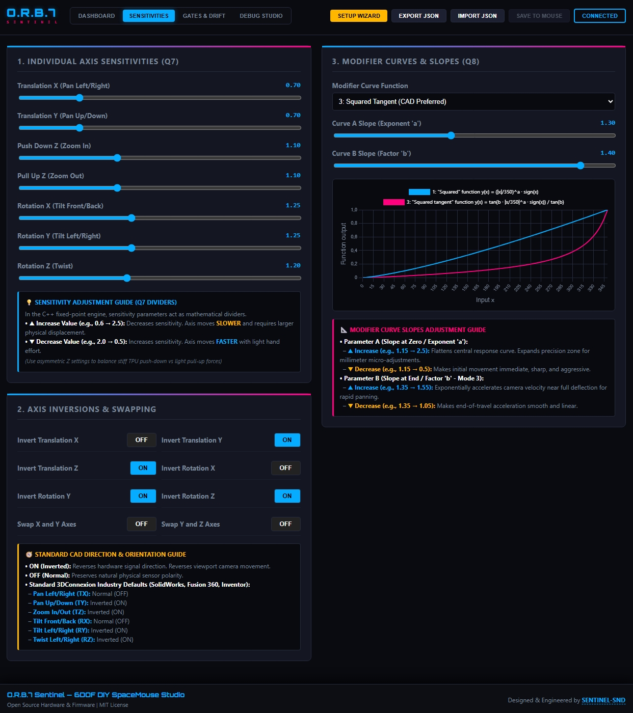
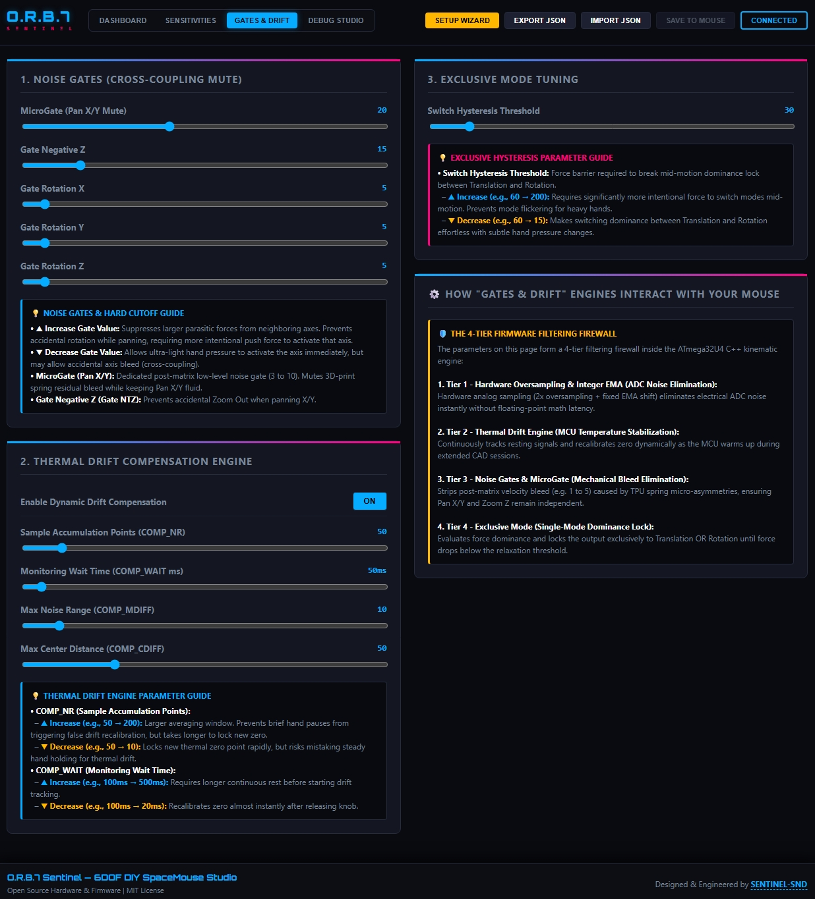
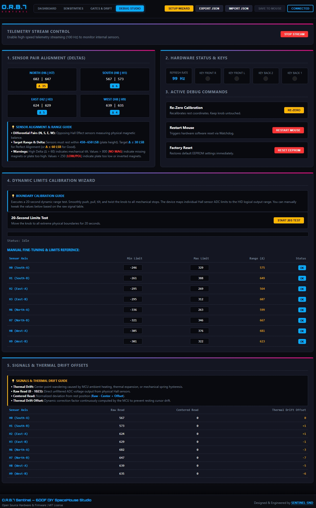

# O.R.B.7 (Orbital Rotation Base + OLED & Web Studio)

[](https://opensource.org/licenses/MIT)
[](https://github.com/)
[](https://github.com/)
[](https://www.microchip.com/)
[](https://wicg.github.io/webhid/)

> DIY 6DOF SpaceMouse Pro Firmware & Printable Chassis | Standalone OLED Hardware Debugger & Driverless Web Studio

---

## 📋 Table of Contents

- [Overview](#-overview)
- [Key Features](#-key-features)
  - [3D-Printable Enclosure & Universal Support](#-3d-printable-enclosure--universal-support)
  - [Standalone OLED Diagnostic Station](#-standalone-oled-hardware-assembly--debugging-station)
  - [Driverless WebHID 3D Studio Suite](#-driverless-webhid-3d-studio-suite-v165)
  - [Core Kinematics & Optimization](#-core-kinematics--extreme-optimization)
  - [ADC Acceleration & Drift Compensation](#-adc-acceleration--thermal-drift-processing)
- [Quick Start](#-quick-start)
- [Hardware Requirements](#-hardware-requirements)
- [Pinout Configuration](#-default-pinout-configuration)
- [Project Background](#-the-story-behind-orb7)
- [Credits & Lineage](#-license-credits--historical-lineage)
- [License](#-license)

---

## 🔍 Overview

**O.R.B.7** is an ultra-optimized, high-performance firmware and hardware ecosystem for DIY 6-DOF (Six Degrees of Freedom) 3D navigation controllers based on the **ATmega32U4** (Arduino Pro Micro). 

Emulating a native **3Dconnexion SpaceMouse Pro** USB HID device, O.R.B.7 combines a **custom 4-button 3D-printed chassis**, a **standalone OLED hardware assembly debugger**, an integer-only **Q7/Q8 fixed-point math engine**, decoupled real-time drift compensation, and a **driverless WebHID 3D Studio (v1.6.5)** to deliver a smooth, high-precision CAD navigation experience.

> [!TIP]
> **Universal Compatibility:**  
> Don't have an OLED screen or using a legacy 8-channel Hall-effect build (e.g., *TeachingTech* or *ArdunHH* designs)? Simply set `#define ENABLE_OLED 0` in `config.h`. The OLED driver is stripped at compile-time to save Flash memory while granting your hardware all performance engine upgrades.

---

## ✨ Key Features

### 🖨️ 3D-Printable Enclosure & Universal Support
* **Official O.R.B.7 4-Button Chassis:** Purpose-built 3D-printable housing optimized for FDM 3D printing tolerances, featuring an integrated OLED bezel and 4 tactile push-buttons (*STL files under final refinement—coming soon*).
* **Universal Backward Compatibility:** Native support for legacy DIY SpaceMouse designs (0, 2, or 4 physical buttons).

---

### 📺 Standalone OLED Hardware Assembly & Debugging Station
Turn your microcontroller into a standalone electronics diagnostic tool using zero RAM buffer displays (`SSD1306AsciiWire`).

> [!IMPORTANT]
> **PC-Free Mechanical Alignment (`Align Sensors` Screen):**  
> Assemble and balance your physical 3D-printed housing directly at your workbench without a computer connected! The built-in screen displays real-time differential deltas ($\Delta$) between opposing Hall sensor pairs, providing instant **`OK` / `ADJUST`** visual feedback as you adjust structural tension.

* **On-Device Zeroing (`Re-Zero` Screen):** Perform rest-coordinate zeroing directly from the physical hardware via a 1-second button hold.
* **Dynamic Limits Tester (`Cal. Limits` Screen):** Run a standalone 20-second dynamic range sampling cycle on-device and persist bounds to EEPROM.
* **Real-Time 6DOF Visualizer:** Zero-flicker mini bar graphs displaying live Translation ($TX, TY, TZ$) and Rotation ($RX, RY, RZ$) velocity outputs.
* **Complete On-Device Configuration Menu:** Tweak Global Sensitivity, Deadzones, Math Curves (LIN, SQR, Tangent), Axis Inversions (`INV TX..RZ`), OLED Auto-Sleep Timers, and CAD Shortcuts directly on the device.

---

### 🌐 Driverless WebHID 3D Studio Suite (v1.6.5)
Manage all internal EEPROM parameters directly from Google Chrome, Edge, or Brave without installing background drivers or executable services.

| Dashboard & 3D Motion Studio | Sensitivities & Modifier Curves |
| :---: | :---: |
| <br>*Live 3D puck visualization, 6DOF bars, telemetry health & 4-button studio.* | <br>*Q7 per-axis tuning, axis inversions & real-time Q8 curve plotter.* |
| **Gates & Drift** | **Debug Studio & Calibration Wizard** |
| <br>*MicroGate control, noise thresholds, thermal anti-drift & exclusive mode.* | <br>*Sensor pair deltas, 20s dynamic limits wizard & manual fine-tuning.* |

* **System Telemetry:** Live monitoring of dynamic Firmware Version, EEPROM XOR Checksum Integrity (`VALID`), ADC Reference Voltage (`2.56V Internal`), Magnetic Balance (`BALANCED`), USB Connection State, and Sampling Frequency (Hz).
* **Interactive Hardware Button Studio:** Map all 4 physical push buttons dynamically across **32 native 3DConnexion HID shortcuts** (*FIT, TOP, FRONT, ISO1, ESC, SHIFT, CTRL, ALT*, etc.) with 1-click presets for **SolidWorks**, **Blender 3D**, and camera views.
* **Remote Hardware Reboot (`Restart Mouse`):** Trigger remote MCU restarts via the AVR Watchdog Timer (`wdt_enable(WDTO_60MS)`) with automatic USB re-enumeration.
* **Hardened 20-Second Calibration Wizard:** Proactive auto Re-Zero, ADC Noise Spike Filtering ($> 900$ / $<-900$), tab-focus monitoring, and validation guards to prevent corrupted saving.
* **Interactive 3D Viewport (Three.js):** Real-time 3D SpaceMouse knob rendering mirroring 6DOF physical hand movements.
* **Curve Visualizer (Chart.js):** Real-time plotting of Q8 math modifiers (Slope A / Slope B) for CAD panning and zooming response curves.
* **JSON Profile Management:** Save and restore complete configuration profiles (`.json`) with a single click.
* **Standalone Deployment:** Monolithic deployment hosted via a single local HTML file (`O.R.B.7 Web Studio v1.6.5.html`).

---

### 📐 Core Kinematics & Extreme Optimization
* **Fixed-Point Arithmetic (Q7/Q8):** The 6DOF motion path is 100% floating-point free at runtime. Sensitivities are scaled via fast bit-shifts to minimize cycle latency on 8-bit AVR microcontrollers.
* **Direct Root MicroGate (`gate_trans`):** Low-level noise gate (0 to 50) applied directly to Translation X and Y prior to sensitivity scaling. Eliminates raw matrix parasitic spring bleed at the root level.
* **Full Physical Travel Matrix Restoration:** Restored optimal matrix divisors (`/2` and `/4`) to prevent physical travel deadband clipping and maximize stroke resolution.
* **Symmetrical Noise Gates & Exclusive Mode:** Multi-axis isolation prevents parasitic axis crosstalk with smooth neutral unlocking on relaxation (`EXCL_RELAX_THRESHOLD`).

---

### ⚡ ADC Acceleration & Thermal Drift Processing
* **250 kHz ADC Clock:** Prescaler optimization (`0x06`) lowers analog conversion latency to **~26 µs** per sample while preserving 10-bit resolution.
* **2x Oversampling & Integer EMA Filtering:** Non-blocking Exponential Moving Average filter with non-stuck rounding logic for smooth, jitter-free motion.
* **Decoupled Per-Axis Drift Tracking:** Independent hardware channels neutralize thermal zero-point drift (caused by ambient temperature swings or mechanical fatigue) without locking active movement.

---

### 🛡️ System Integrity & Reliability
* **EEPROM Memory Firewall:** Struct packed parameter storage (`ParamStorage`, 37 parameters) protected by an 8-bit XOR checksum and rigid bounds.
* **Watchdog Loop Protection:** Explicit flag clearance (`MCUSR = 0; wdt_disable();`) at boot prevents infinite reboot loops.
* **I2C Bus Recovery Guard:** 3 ms hardware timeout automatic recovery against ESD/noise I2C bus stalls.
* **CAD Viewport Isolation:** Kinematic output and HID reports automatically pause while browsing OLED menus or saving web settings to prevent accidental CAD viewport spins.

---

## 🚀 Quick Start

> [!WARNING]
> **Mandatory Hardware Step:**  
> Before flashing the firmware, you **must** configure a custom board entry in Arduino IDE with 3Dconnexion's Vendor ID (VID) and Product ID (PID). This allows operating systems and official CAD drivers to natively recognize the device as a genuine 3Dconnexion SpaceMouse Pro.

### 1. Download Latest Release
Download the latest pre-packaged source and firmware zip from the [O.R.B.7 Releases](../../releases) page.

### 2. Configure Arduino IDE (`boards.txt`)
Follow the official guide on [Creating a Custom Board for Arduino IDE](https://github.com/AndunHH/spacemouse/wiki/Creating-a-custom-board-for-Arduino-IDE):

1. Locate your Arduino IDE installation directory and find `boards.txt` (typically located in `C:\Users\YourName\AppData\Local\Arduino15\packages\arduino\hardware`).
2. Add a new custom board definition or modify an existing **Arduino Leonardo** entry with the official USB identifiers:
   ```ini
   # 3Dconnexion SpaceMouse Pro Emulation Settings
   leonardo.build.vid=0x256F
   leonardo.build.pid=0xC62B
   leonardo.build.usb_product="SpaceMouse Pro"
   ```
3. Save `boards.txt` and restart Arduino IDE.

### 3. Flash Firmware
1. Open the downloaded O.R.B.7 firmware in Arduino IDE.
2. Install the required library via Library Manager:
   * **`SSD1306Ascii`** (by Bill Greiman)
3. Select your custom board entry (or configured **Arduino Leonardo**) and correct COM port.
4. Configure hardware options in `config.h`:
   ```cpp
   #define ENABLE_OLED 1  // Set to 0 if omitting the OLED screen or using other versions of spacemouse
   ```
5. Click **Upload**.

### 4. Open WebHID Studio
1. Download or open [O.R.B.7 Web Studio v1.6.5.html](./O.R.B.7%20Web%20Studio%20v1.6.5.html) directly from this repository.
2. Double-click `O.R.B.7 Web Studio v1.6.5.html` to run locally.
3. Click **Connect Device** and select your SpaceMouse from the browser popup.

---

## 🛠️ Hardware Requirements

* **Microcontroller:** ATmega32U4 (Arduino Pro Micro 5V / 16 MHz).
* **Sensors:** 8x Ratiometric Linear Hall-Effect Sensors (AH49E or equivalent).
* **3D Printed Chassis:** Official **O.R.B.7 4-Button Enclosure** (*STL coming soon*) OR legacy DIY SpaceMouse housings (*TeachingTech*, *ArdunHH*).
* **Display (Optional):** 0.96" OLED SSD1306 (128x64 pixels, I2C address `0x3C`).
* **Buttons (Optional):** Up to 4 Tactile Push Buttons (ORB7 layout) or up to 32 buttons using internal `INPUT_PULLUP`.

---

## 🔌 Default Pinout Configuration

| Component / Function | Sensor / Button | Pro Micro Pin | Description |
| :--- | :--- | :--- | :--- |
| **OLED SDA** | Hardware I2C | **Pin 2** | I2C Data (400 kHz) |
| **OLED SCL** | Hardware I2C | **Pin 3** | I2C Clock (400 kHz) |
| **Hall Sensor HES0** | South Pair (A) | **A0** | Analog Input |
| **Hall Sensor HES1** | South Pair (B) | **A1** | Analog Input |
| **Hall Sensor HES2** | East Pair (A) | **A2** | Analog Input |
| **Hall Sensor HES3** | East Pair (B) | **A3** | Analog Input |
| **Hall Sensor HES6** | North Pair (A) | **Pin 4 (A6)** | Analog Input |
| **Hall Sensor HES7** | North Pair (B) | **Pin 6 (A7)** | Analog Input |
| **Hall Sensor HES8** | West Pair (A) | **Pin 8 (A8)** | Analog Input |
| **Hall Sensor HES9** | West Pair (B) | **Pin 9 (A9)** | Analog Input |
| **Button Front Right [R]** | `keys[0]` | **Pin 0** | Dynamic HID Shortcut |
| **Button Front Left [L]** | `keys[1]` | **Pin 1** | Dynamic HID Shortcut |
| **Button Back Left [2]** | `keys[2]` | **Pin 5** | Dynamic HID Shortcut |
| **Button Back Right [1]** | `keys[3]` | **Pin 7** | Dynamic HID Shortcut |

*(Note: Pins can be freely reassigned in `config.h` to suit custom hardware configurations.)*

---

## 📖 The Story Behind O.R.B.7

What started as a simple hobby project to enhance [AndunHH](https://github.com/AndunHH)'s DIY SpaceMouse quickly turned into an engineering deep dive. 

My initial goal was modest: add an OLED display for a modern aesthetic and easier debugging. However, during hardware assembly, I realized the OLED could serve a far more vital role: **turning the controller into a standalone hardware diagnostic station.**

### Why "O.R.B.7"?
* **O.R.B. (Orbital Rotation Base):** Reflects the core mechanics of the controller—allowing smooth, 3D spatial pivoting and rotation around an orbital axis.
* **7:** Represents the 7th major architecture revision, marking the unified release of the standalone OLED debugger, WebHID Studio, and real-time telemetry engine.

---

## 📜 License, Credits & Historical Lineage

O.R.B.7 stands on the shoulders of the open-source DIY SpaceMouse community. Gratitude to the pioneer creators who shared their foundational code, math models, and mechanical concepts:

* **[Shiura](https://www.thingiverse.com/thing:5739462):** Original *Space Mushroom* mechanism concept.
* **[jfedor](https://pastebin.com/gQxUrScV) & [BennyBWalker](https://pastebin.com/erhTgRBH):** Native 3Dconnexion SpaceMouse USB HID protocol emulation.
* **[fdmakara](https://www.thingiverse.com/thing:5817728):** 4-joystick/sensor matrix kinematics.
* **[TeachingTech](https://www.youtube.com/@TeachingTech):** Consolidated joystick mixing, USB HID integration, and video guides.
* **Daniel_1284580:** Dynamic calibration range logic and original **Modifier Function** curve algorithm.
* **LivingTheDream:** Firmware optimizations and curve mathematical refinements.
* **JoseLuisGZA:** Kill-keys implementation and encoder integration logic.
* **[AndunHH](https://github.com/AndunHH):** Hall-effect matrix adaptation, ADC dead-zones, thermal drift tracking, and author of the baseline project that directly inspired O.R.B.7.

---

## 📄 License

Distributed under the **MIT License**. Open-source software—free to use, modify, and distribute for personal and commercial applications.
